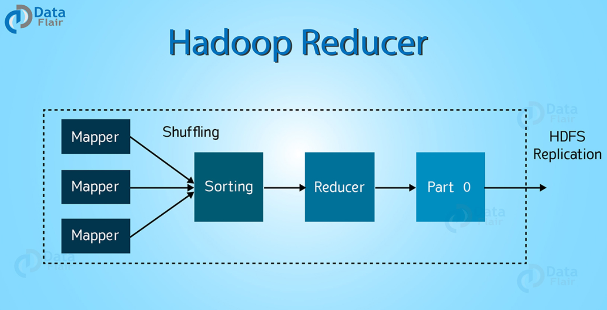
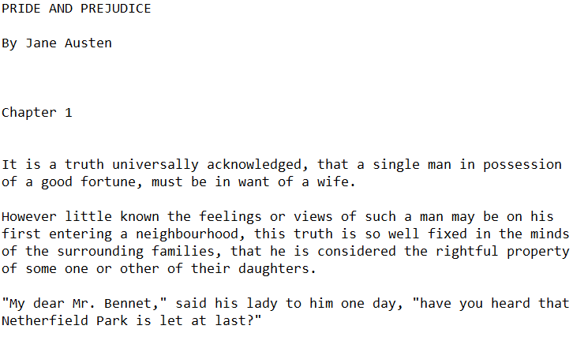
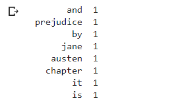
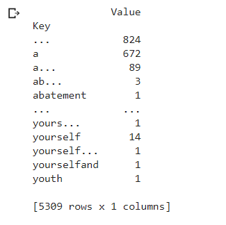

# Mapper-Reducer-Implementation-from-Scratch

### Table of contents
* [Introduction](#introduction)
* [What is a Mapper Reducer?](#what-is-a-mapper-reducer?)
* [Problem Statement](#problem-statement)
* [Data Source](#data-source)
* [Technologies](#technologies)
* [Type of Data](#type-of-data)
* [Data Pre-processing](#data-pre-processing)
* [Algorithms Implemented](#algorithms-implemented)
* [Steps Involved](#steps-involved)
* [Evaluation Metrics](#evaluation-metrics)
* [Results and Conclusion](#results-and-conclusion)

### Introduction
The objective of the project is to develop a mapper reducer function which can perform the same functionalities of a mapper reducer used in big data applications. Implemented Multi-threading operations for faster parallel processing of data.

### What is a Mapper Reducer?
MAPREDUCE is a software framework and programming model used for processing huge amounts of data.

MapReduce program work in two phases, namely, Map and Reduce. 
* Map    - It deals with splitting and mapping of data while
* Reduce - It deals with shuffling the mapper output and sorting and reducing the data.

### Problem Statement
* Build a mapper reducer function implementation from scratch using Python.

### Data Source
* Pride and Prejudice Book - https://www.planetebook.com/free-ebooks/pride-and-prejudice.pdf

### Technologies
* Python 3.6.7
* PySpark
* Multithreading

### Type of Data
* The dataset is text file consisting of the famous Pride and Prejudice book

### Data Pre-processing
* Tokenizing, removal of stop words and stemming was done for textual data

### Algorithms Implemented
* Mapper  Function from Scratch
* Reducer Function from Scratch

### Steps Involved

STEP 1 : Data Cleaning

STEP 2 : Split the file into 2 parts - file1 containing first 5000 lines and file2 containing the rest 

STEP 3: Tokenized the words in each file

STEP 4: Used a Counter to count the number of occurences of each word in the file which is the function of Mapper. Essentially, Mapper here is simply the term frequency.

STEP 5: Sort the above Mapper output and count the number of occurences of each word which is the function of a reducer. 

So let me explain the difference between Mapper and Reducer in-detail here. Consider we have the below file -  

Example file : 

"a man is standing there is a rockstar" 

Mapper Function : Tokenizes the sentence and counts the number of occurences of each word.

Mapper Output:

a - 1

man - 1

is - 1

standing - 1

there - 1

is - 1

a - 1

rockstar - 1

Reducer Function      : Sorts the above output and groups by the words and counts its occurences.

Mapper Layer 1 Output : Sorts the Mapper Output

a        - 1

a        - 1

is       - 1

is       - 1

man      - 1

rockstar - 1  

standing - 1

there    - 1

Mapper Layer 2 Output : Groups by the above output and displays the count of each word in the file

a        - 2

is       - 2

man      - 1

rockstar - 1

standing - 1

there    - 1

That's great! We have now implemented our own Mapper Reducer function. 

### Evaluation Metrics  
There are no evaluation metrics for this program. 

### Results and Conclusion
So far, we have implemented mapper reducer from scratch. Now, let's look at the output of our function - 

Mapper Output

Reducer Output

